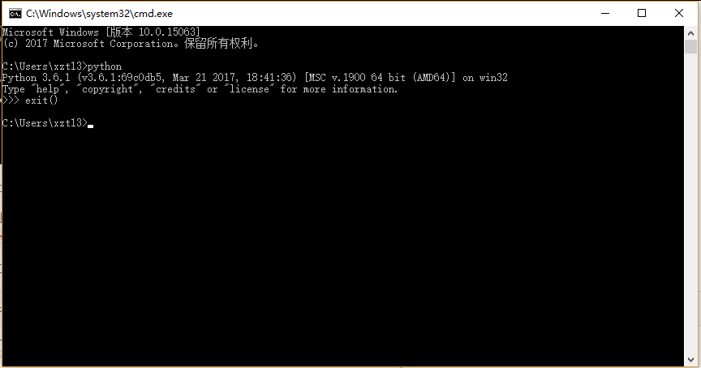
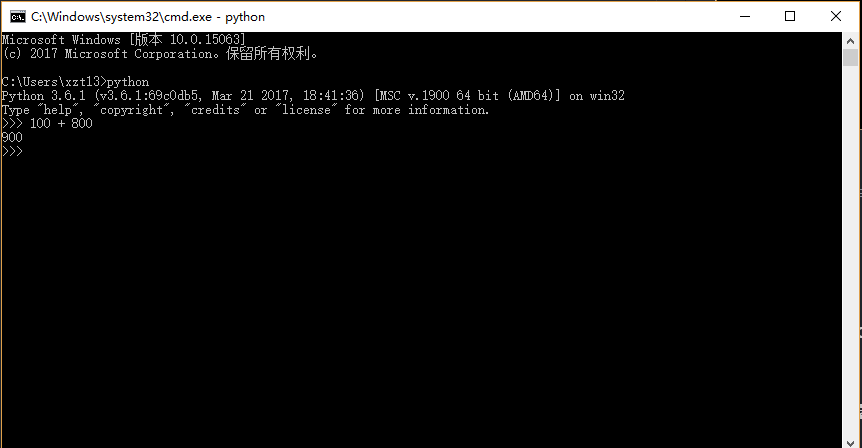
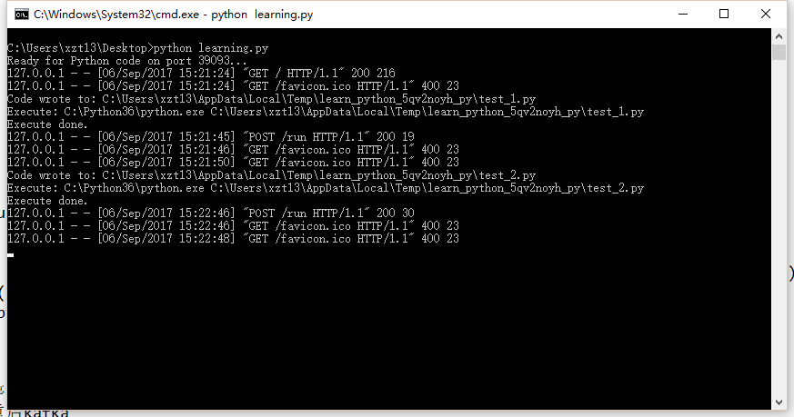
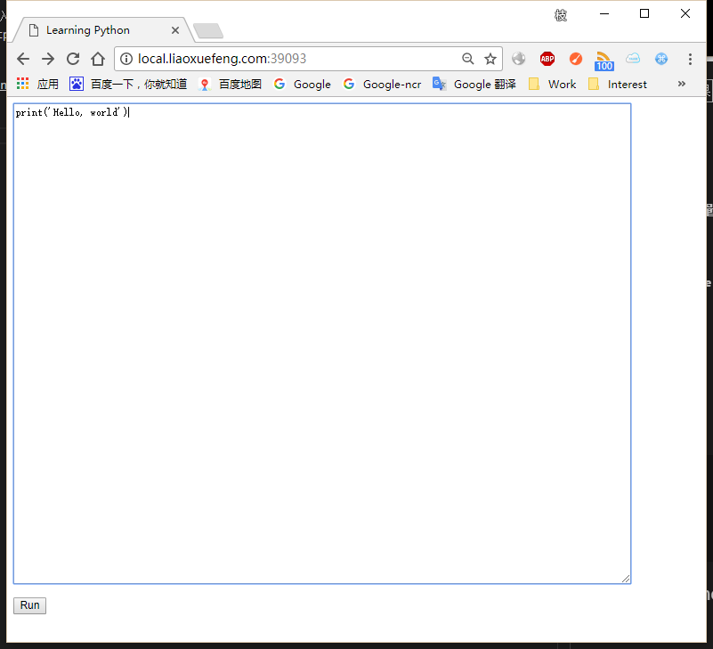
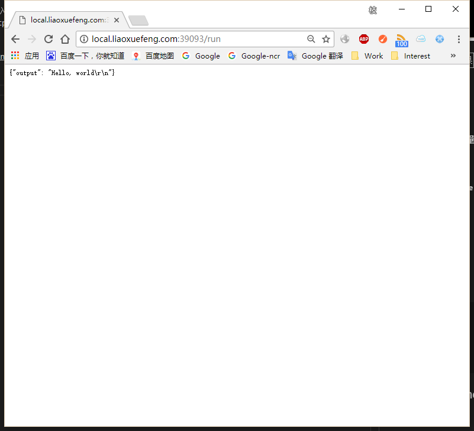

# 目录
[廖雪峰Python3教程](https://www.liaoxuefeng.com/wiki/0014316089557264a6b348958f449949df42a6d3a2e542c000)
## 1. 第一篇 Python基础

### 1.1 Python简介

>Life is short, use Python.     
>创始人：Guido van Rossum("龟叔",吉多范罗苏姆)，荷兰人。   
>实例：YouTube，Instagram，豆瓣等。  
>应用：网络应用(网站、后台服务)，日常工具(脚本任务、自动化)，爬虫、大数据(数据挖掘、数据清洗)。    
>优点：1.优雅，明确，简单。尽量写容易看明白的代码，尽量写少的代码；2.完善的基础代码库，大量的第三方库。    
>缺点：1.解释型语言运行速度慢；2.代码不能加密，发布的程序就是发布源代码。

### 1.2 安装Python

Windows平台安装注意勾选添加Python环境变量。



#### 1.2.1 Python解释器

1. CPython(广泛使用)
2. IPython
3. PyPy
4. Jython
5. IronPython

### 1.3 第一个Python程序

Python交换式IDE环境:


>在Python交换式命令行下，可以直接输入代码，然后执行，并立刻得到结果。

#### 1.3.1 使用文本编辑器

文本编辑器(把IDE也写进去了)推荐：

1. Sublime Text 2/3 收费
2. Notepad++ 免费
3. Visual Studio Code(VS Cod大法好) 免费
4. PyCharm 收费
5. Atom(Github出品) 免费

[test.py](test.py)

```python
print(100+200)
```

执行python文件test.py，在命令行中，切换到该文件所在目录，然后输入`python test.py`即可执行。

#### 1.3.2 Python代码运行助手

Python代码运行助手可以让你在线输入Python代码，然后通过本机运行的一个Python脚本来执行代码。
这个有点酷炫啊，在本机开了一个http服务。

启动Python运行助手：       


运行结果：       
     



#### 1.3.3 输入和输出

`print('The quick brown fox','jumps over','the lazy dog')`

The quick brown fox jumps over the lazy dog.
覆盖了英文的2个字母，通常这句话用来测试。中文对应的有永字八法，千字文等。

### 1.4 Python基础

Python使用缩进来组织代码块，遵守约定俗成的习惯，使用4个空格的缩进(Tab)。
在文本编辑器(IDE)中，设置Tab自动转换为4个空格，确保不混用Tab和空格。

以`#`开头的语句是注释，注释是给人看的，可以是任意内容，解释器会忽略掉注释。其他每一行都是一个语句，当语句以冒号`:`结尾时，缩进的语句视为代码块。

Python程序是大小写敏感的，如果写错了大小写，程序会报错。

#### 1.4.1 数据类型和变量

数值类型：整数、浮点数    
字符串类型：`"test"`, `'for'`,`'''多行内容'''`   
布尔类型：`True`, `False`   
布尔运算： `and`, `or`, `not`   
转义字符：`\`   
`r' '`表示不转义     
`=`表示赋值     

动态语言：变量本身类型不固定，比如Python     
`a = 123`   
`a = 'test'`    
静态语言：变量定义时必须指定变量类型，比如Java   
`int a = 123`   
`string a = "test"`


整数的地板除//永远是整数，即使除不尽。要做精确的除法，使用/就可以。

#### 1.4.2 字符串和编码

#### 1.4.3 使用list和tuple

`list`可变，`pop()`,`append()`,`len()`     
`tuple`不可变，在定义tuple的时候,tuple的元素就必须被确定下来。        
list和tuple是Python内置的有序集合，一个可变，一个不可变

#### 1.4.4 条件判断

`if`判断简写：

```python
if x:
    print("True")
```

只要x是非零数值、非空字符串、非空list等，就判断为True，否则为False。

`if`语句执行是从上往下判断，如果在某个判断上是True，把该判断对应的语句执行后，就忽略掉剩下的elif和else，在写`if`判断的时候一定要注意逻辑顺序。

#### 1.4.5 循环

`for`或者`while`     
`break`语句在循环过程中直接退出循环，`continue`语句结束本轮循环，并开始下一轮循环，这两个语句通常都必须配合`if`语句使用。     
注意：不要滥用`break`和`continue`语句。`break`和`continue`会造成代码执行逻辑分叉过多，容易出错，大多数循环并不需要用到`break`和`continue`语句。


#### 1.4.6 使用dict和set

dict等同于其他语言中的map, key-value键值对存储，具有极快的查找速度。用`{}`来声明dict，key不允许重复        
一个key只能对应一个value，多次对一个key放入value，后面的值会覆盖前面的值。       
判断key是否存在：      
1)
`key_name in d`     
2)`d.get(key_name)`     
删除key，对应的value也会从dict中删除：       
`d.pop(key)`            
dict的key必须是不可变对象(int,str等),因为dict根据key来计算value的存储位置，如果每次计算相同的key得出的结果不同，那dict内部就完全混乱了。这个通过key计算位置的算法称为哈希算法（Hash）。list是可变的，不能作为key。

set，一组key的集合，key必须为不可变对象(int,str等)，key不允许重复，不存储value，无序存储。         
创建一个set，需要提供一个list作为输入集合：
```python
s = set([1, 2, 3])
print(s)
```         
添加元素到set：
`s.add(key)`        
删除元素:
`s.remove(3)`       
set可以做交集、并集等操作：
```python
s1 = set([1, 2, 3])
s2 = set([2, 3, 4])
# 求交集
s1 & s2
# 求并集
```         
对于不变对象(str,int等)，调用对象自身的任意方法(比如：`str.replace()`)，也不会改变对象自身的内容，相反，这些方法会创建新的对象并返回，这样，就保证了不可变 对象本身永远是不可变的。     
set集合存放的是Key，而key在dict字典里定义的是不能改变的，也是最终的值。      
而tuple元组里存放的值也是不可改变的，只能用于读取，那么就可以放入set。     
如果tuple存放的对象本身是可以改变的（添加、删除、更新）那么就违反了key的定义，所以在Python运行后会报错

### 1.5 函数

>函数与抽象

#### 1.5.1 调用函数

`abs()`求绝对值     
`hex()`把一个整数转换成十六进制表示的字符串       
`int() float() str() bool()`等
`call_func.py`

#### 1.5.2 定义函数

函数定义：`def`语句，一次写出函数名、括号、括号中的参数和冒号`:`，然后，在缩进块中编写函数体，函数的返回值用`return`语句返回。

```python
def function_name(args):
```

```python
def my_abs(x):
    if x >= 0:
        return x
    else:
        return -x

```
空函数：使用`pass`语句作为占位符，比如现在还没想好怎么写函数的代码，就可以先放一个`pass`，让代码能运行起来。
```python
def nop():
    pass
```
返回多个值：实际返回的是一个tuple
```python
import math

def move(x, y, step, angle=0):
    nx = x + step * math.cos(angle)
    ny = y - step * math.sin(angle)
    return nx, ny
```
总结：定义函数时，需要确定函数名和参数个数；
如果有必要，可以先对参数的数据类型做检查；
函数体内部可以用`return`随时返回函数结果；
函数执行完毕也没有`return`语句时，自动`return None`；
函数可以同时返回多个值，但其实就是一个tuple。

#### 1.5.3 函数的参数

>位置参数：普通的参数。        

>默认参数：默认参数必须指向不变对象(int, str, None等可以，list类型不行)。降低了函数调用的难度，而一旦需要更复杂的调用时，又可以传递更多的参数来实现。无论是简单调用还是复杂调用，函数值只需要定义一个。       
必选参数在前，默认参数在后。当函数有多个参数时，把变化大的参数放前面，变化小的参数放后面。变化小的参数可以作为默认参数。        

>不变对象的好处：一旦创建，对象内部的数据就不能修改，这样就减少了由于修改导致的错误。此外，由于对象不变，多任务环境下同时读取对象不需要加锁，同时读一点问题也没有。在编写程序时，如果可以设计一个不变对象，那就尽量设计成不变对象。       

>可变参数：传入的参数是可变的，允许你传入0个或者任意个参数，这些可变参数在函数调用时自动组装为一个tuple。
可变参数的定义：在参数前面加`*`，如：`*nums`。

```python
# 给定一组数字a，b，c……，请计算a2 + b2 + c2 + …… 求任意个参数的平方和
def calc(*nums):
    sum = 0
    for n in nums:
        sum = sum + nums ** 2
    return sum
```
>关键字参数：允许传入0个或任意个含参数名的参数，这些关键字参数在函数内部自动组装为一个dict。       
关键字参数的定义：添加`**kw`参数。

>命名关键字参数：命名关键字参数需要一个特殊分隔符`*`，`*`后面的参数被视为命名关键字参数。        
命名关键字参数必须传入参数名，这和位置参数不同。如果没有传入参数名，调用将报错。        
如果函数定义中已经有了一个可变参数，后面跟着的命名关键字参数就不再需要一个特殊分隔符*了。

>参数组合：参数定义的顺序必须是：必选参数、默认参数、可变参数、命名关键字参数和关键字参数       
对于任意函数，都可以通过类似func(*args, **kw)的形式调用它，无论它的参数是如何定义的。


#### 1.5.4 递归函数

函数在内部调用自身本身，这个函数就是递归函数。
使用递归函数需要注意防止栈溢出。在计算机中，函数调用是通过栈（stack）这种数据结构实现的，每当进入一个函数调用，栈就会加一层栈帧，每当函数返回，栈就会减一层栈帧。由于栈的大小不是无限的，所以，递归调用的次数过多，会导致栈溢出。

解决递归调用栈溢出的方法是通过尾递归优化，事实上尾递归和循环的效果是一样的，所以，把循环看成是一种特殊的尾递归函数也是可以的。

尾递归是指，在函数返回的时候，调用自身本身，并且，return语句不能包含表达式。这样，编译器或者解释器就可以把尾递归做优化，使递归本身无论调用多少次，都只占用一个栈帧，不会出现栈溢出的情况。

## 2. 第二篇 Python高级

### 2.1 高级特性

Python,代码不是越多越好，而是越少越好；代码不是越复杂越好，而是越简单越好。
代码越少，开发效率越高。

#### 2.1.1 切片

适用类型：list,tuple,str
`list[0:3]`正切片，从左往右取，索引0,1,2,...,len(list)-1
`list[-2:]`倒切片，从右往左取，索引-1,-2,...,-len(list)

#### 2.1.2 迭代

适用类型：可迭代对象(list,tuple,dict,str),自定义的符合迭代条件的数据类型。

`for ... in ... : `

```python
# 迭代list
for value in ['a', 'b', 'c':
    print(value)

# 类似Java使用下标循环,调用enumerate函数把list变成索引-元素对
for i, value in enumerate(['a', 'b', 'c']):
    print(i, value)
```

```python
# 迭代str
for i in 'ABCDEFG':
    print(i)
```

```python
# 迭代dict，默认是key
d = [1:'a', 2:'b', 3:'c']
for key in d:
    print(key)

# 迭代dict的value
for value in d.values():
    print(value)

# 迭代dict, key,value同时迭代
for k,v in d.items():
    print(k, v)
```

```python
# 迭代时引用两个变量
for x,y in [(1, 1), (2, 4), (3, 9)]:
    print(x, y)
```

判断一个对象是否为可迭代对象：返回True或者False
>`isinstnce(object, collections.Iterable)`

```python
from collections import Iterable
print(isinstance('abcde', Iterable))

```

#### 2.1.3 列表生成式

列表生成式List Comprehensions,用来创建list的生成式。

```python
# 生成[1x1, 2x2, 3x3, ..., 10x10]
[x * x for x in range(1, 11)]
# [1, 4, 9, 16, 25, 36, 49, 64, 81, 100]

# for循环后面可以跟判断,筛选出仅偶数的平方
[x * x for x in range(1, 11) if x % 2 == 0]
# [4, 16, 36, 64, 100]

# 可以使用两层循环，生成全排列
[ m + n for m in 'ABC' for n in 'XYZ']
#　['AX', 'AY', 'AZ', 'BX', 'BY', 'BZ', 'CX', 'CY', 'CZ']

# 循环前可以调用函数
# 把list中的所有字符变成小写
L = ['Hello', 'World', 'Visual', 'Studio', 'Code']
[s.lower() for s in L]
# ['hello', 'world', 'visual', 'studio', 'code']

#　列表生成式中的for循环使用迭代相关特性
#　使用两个变量生成list

d = {'x':'A', 'y':'B', 'z':'C'}
[k + '=' + v for k, v in d.items()]
# ['x=A', 'y=B', 'z=C']
```

应用举例：

```python
# 列出当前目录下的所有文件和目录名
# os.listdir()可以列出文件和目录

import os
[d forf d in os.listdir('.')]
```

#### 2.1.4 生成器

生成器(generator):可迭代对象，只保存算法，一边循环一边计算，节约了内存空间。        
定义generator的方式：     
1.使用`()`的创建的列表生成式:(x * x for x in range(1, 11))     
2.使用`yield`关键字在函数中声明


>1.使用`()`的创建的列表生成式：

```python
# L是个使用列表生成式生成的list
L = [x * x for x in range(1, 11)]
# 可以直接输出L的每一个元素
print(L)

# g是个generator,使用()的创建的列表生成式
g = (x * x for x in range(1, 11))
# 输出generator的每一个元素，可以使用next函数
>>> next(g)
1
>>> next(g)
4
>>> next(g)
9
>>> next(g)
16
>>> next(g)
25
>>> next(g)
36
>>> next(g)
49
>>> next(g)
64
>>> next(g)
81
>>> next(g)
100
>>> next(g)
Traceback (most recent call last):
  File "<pyshell#23>", line 1, in <module>
    next(g)
StopIteration
# generator保存的是算法，每次调用next(g)，就计算g的下一个元素的值，直到计算最后一个元素，没有更多元素时，抛出StopIteration错误。
# 正确做法是使用for循环
for value in g:
    print(value)

```

>2.使用`yield`关键字在函数中声明

```python
# 输出斐波那契数列
# 1, 1, 2, 3, 5, 8, 13, 21, 34, ...

# 常规做法：fib函数
def fib(max):
    n, a, b = 0, 0, 1
    while n < max:
        a, b = b, a+b
        n = n + 1
    return 'done'
print(fib(6))

a = fib

#　test

def fib(max):
    n, a, b = 0, 0, 1
    while n < max:
        a, b = b, a+b
        n = n + 1

```


#### 2.1.5 迭代器

>没怎么看懂

### 2.2 函数式编程


#### 2.2.1 高阶函数

变量可以指向函数，即函数本身可以赋值给变量。
高阶函数：一个函数接收另一个函数作为参数（把函数作为参数传入），这种函数就称之为高阶函数。类似于C语言中的指针。

```python
def add(x, y, f):
    return f(x) + f(y)

add(-5, 6, abs)
"""
x = -5
y = 6
f = abs # 将函数赋值给变量
f(x) + f(y) = abs(-5) + abs(6) ===> 11
return 11

"""

```

##### 2.2.1.1 map/reduce

Python內建`map()`和`reduce()`函数。
>1. `map()`函数接收两个参数，一个是函数，一个`Iterable`(可迭代序列)，`map`将传入的函数依次作用到序列的每个元素，并把结果作为新的`Iterator`(惰性序列)返回。实际是对运算规则进行抽象，方便计算任意复杂的函数。

```python
# 举例：序列元素求平方

def f(x):
    return x * x

result = map(f, [1, 2, 3, 4, 5, 6, 7, 8])
print(list(result))
# [1, 4, 9, 16, 25, 36, 49, 64]
```

>2. `reduce()`函数，把一个函数`f(x, y)`作用在一个序列`[x1, x2, x3, ...]`上，这个函数`f(x, y)`必须接收两个参数(x, y)，`reduce()`把结果继续和序列的下一个元素做累积计算。

```python
# 举例：序列求和
from functools import reduce
def add(x, y):
    return x + y

reduce(add, [1, 3, 5, 7, 9])
# add(add(add(add(1, 3), 5), 7), 9)
# 1 + 3 + 5 + 7 + 9
# 25
```

>3. `map()`和`reduce()`可以混合使用

```python
举例：把str转换成int

from functools import reduce

def str2int(s):
    def fn(x, y):
        return x * 10 + y
    def char2num(s):
        return {'0' : 0, '1' : 1, '2' : 2, '3' : 3, '4' : 4, '5' : 5, '6' : 6, '7' : 7, '8' : 8, '9' : 9}[s]
    return reduce(fn, map(char2num, s))

# str2int('13579')
# 13579
```

可以使用`lambda`函数进一步简化：
```python
from functools import reduce

def char2num(s):
    return {'0' : 0, '1' : 1, '2' : 2, '3' : 3, '4' : 4, '5' : 5, '6' : 6, '7' : 7, '8' : 8, '9' : 9}[s]

def str2int(s):
    return reduce(lambda x, y: x * 10 + y, map(char2num, s))

# str2int('13579')
# 13579

```


## 练习：

1.利用`map()`函数，把用户输入的不规范的英文名字，变为首字母大写，其他小写的规范名字。输入：`['adam', 'LISA', 'barT']`，输出：`['Adam', 'Lisa', 'Bart']`

```python
def normalize(name):
    return name[0].upper() + name[1:len(name)].lower()

L1 = ['adam', 'LISA', 'barT']
L2 = list(map(normalize, L1))
print(L2)
# 'Adam', 'Lisa', 'Bart']
```

2.Python提供的`sum()`函数可以接收一个list并求和，请编写一个`prod()`函数，可以接收一个list并利用`reduce()`求积。

```python
from functools import reduce

def prod(L):
    def multiply(x, y):
        return x * y
    return reduce(multiply, L)

print('3 * 5 * 7 * 9 =', prod([3, 5, 7, 9])
```

3.利用`map()`和`reduce()`编写一个`str2float`函数，把字符串`'123.456'`转换成浮点数`123.456`

```python
from functools import reduce

def str2float(s):
    # 字符转数字
    def char2num(s):
        return {'0' : 0, '1' : 1, '2' : 2, '3' : 3, '4' : 4, '5' : 5, '6' : 6, '7' : 7, '8' : 8, '9' : 9, '.' : '.'}[s]

    # 整数部分
    def fn(x, y):
        return x * 10 + y

    # 切割字符串并进行处理计算
    [s1, s2] = s.split('.')

    # 整数部分正常计算 [1, 2, 3]，fn(fn(1, 2), 3) = (1 * 10 + 2) * 10 + 3 = 123
    float_integer = reduce(fn, list(map(char2num, s1)))
    # 小数部分: [4, 5, 6]先按照整数部分计算得456，然后除以10^len(s2)，10^3=1000
    # 456/1000 = 0.456
    # ** 表示幂计算，乘方，10**3，即10的3次方
    float_decimal = reduce(fn, list(map(char2num, s2)))/(10 ** len(s2))
    return float_integer + float_decimal

print(str2float('123.456'))

# lambda简化写法

def str2float(s):
    # 字符转数字
    def char2num(s):
        return {'0' : 0, '1' : 1, '2' : 2, '3' : 3, '4' : 4, '5' : 5, '6' : 6, '7' : 7, '8' : 8, '9' : 9, '.' : '.'}[s]
    s = s.split('.')
    float_integer = reduce(lambda x, y: x * 10 + y, map(char2num ,s[0]))
    float_decimal = reduce(lambda x, y: x * 10 + y, map(char2num ,s[1]))/(10 ** len(s[1]))

```


##### 2.2.1.2 filter

Python內建函数`filter()`用于过滤序列(过滤和筛选作用)。和`map`类似，`filter()`也接收一个函数和一个序列。和`map()`不同的是，`filter()`把传入的函数依次作用于每个元素，然后根据返回值是`True`还是`False`决定保留还是丢弃该元素。

```python
# 举例： 删除list中的偶数，只保留奇数

def is_odd(n):
    return n % 2 == 1

list(filter(is_odd, [1, 2, 3, 4, 5, 6, 7, 8]))

```

>用`filter()`求素数：不想看(⊙﹏⊙)

### 练习
回数是指从左向右读和从右向左读都是一样的数，例如12321，909。请利用`filter()`滤掉非回数：

```python
def is_palindrome(n):
    list_numbers = list(str(n))
    i = 0
    j = len(list_numbers)
    for item in list_numbers:
        if list_numbers[i] != list_numbers[j-1]:
            return False
        else:
            continue
        i = i + 1
        j = j - 1
    return n
output = filter(is_palindrome, range(1, 1000))
print(list(output))

```

##### 2.2.1.3 sorted


#### 2.2.2 返回函数


#### 2.2.3 匿名函数


#### 2.2.4 装饰器


#### 2.2.5 偏函数


### 2.3 模块


#### 2.3.1 使用模块


#### 2.3.2 安装第三方模块

## 3. 第三篇 Python进阶

### 3.1 面向对象编程

#### 3.1.1 类和实例


#### 3.1.2 访问限制

#### 3.1.3 继承和多态

#### 3.1.4 获取对象信息

#### 3.1.5 实例属性和类属性

### 3.2 面向对象高级编程

#### 3.2.1 使用__slots__

#### 3.2.2 使用@property

#### 3.2.3 多重继承

#### 3.2.4 定制类

#### 3.2.5 使用枚举类

#### 3.2.6 使用元类

### 3.3 错误、调试和测试

#### 3.3.1 错误处理

#### 3.3.2 调试

#### 3.3.3 单元测试

#### 3.3.4 文档测试

### 3.4 IO编程

#### 3.4.1 文件读写

#### 3.4.2 StringIO和BytesIO

#### 3.4.3 操作文件和目录

#### 3.4.4 序列化

### 3.5 进程和线程

#### 3.5.1 多进程

#### 3.5.2 多线程

#### 3.5.3 ThreadLocal

#### 3.5.4 进程 vs. 线程

#### 3.5.5 分布式进程

### 3.6 正则表达式

### 3.7 常用内建模块

#### 3.7.1 datetime

#### 3.7.2 collections

#### 3.7.3 base64

#### 3.7.4 struct

#### 3.7.5 hashlib

#### 3.7.6 itertools

#### 3.7.7 contextlib

#### 3.7.7 XML

#### 3.7.8 HTMLParser

#### 3.7.9 urllib

### 3.8 常用第三方模块

#### 3.8.1 PIL

### 3.9 virtualenv

### 3.10 图形界面

## 4. 第四篇 Python网络编程

### 4.1 网络编程

#### 4.1.1 TCP/IP简介

#### 4.1.2 TCP编程

#### 4.1.3 UDP编程

### 4.2 电子邮件

#### 4.2.1 SMTP发送邮件

#### 4.2.2 POP3收取邮件

### 4.3 访问数据库

#### 4.3.1 使用SQLite

#### 4.3.2 使用MySQL

#### 4.3.3 使用SQLAlchemy

### 4.4 Web开发

#### 4.4.1 HTTP协议简介

#### 4.4.2 HTML简介

#### 4.4.3 WSGI接口

#### 4.4.4 使用Web框架

#### 4.4.5 使用模板

### 4.5 异步IO

#### 4.5.1 协程

#### 4.5.2 asyncio

#### 4.5.3 async/await

#### 4.5.4 aiohttp

## 5. 第五篇 Python实战

### Day 1 - 搭建开发环境

### Day 2 - 编写Web App骨架

### Day 3 - 编写ORM

### Day 4 - 编写Model

### Day 5 - 编写Web框架

### Day 6 - 编写配置文件

### Day 7 - 编写MVC

### Day 8 - 构建前端

### Day 9 - 编写API

### Day 10 - 用户注册和登录

### Day 11 - 编写日志创建页

### Day 12 - 编写日志列表页

### Day 13 - 提升开发效率

### Day 14 - 完成Web App

### Day 15 - 部署Web App

### Day 16 - 编写移动App


## 6. FAQ

### 期末总结
